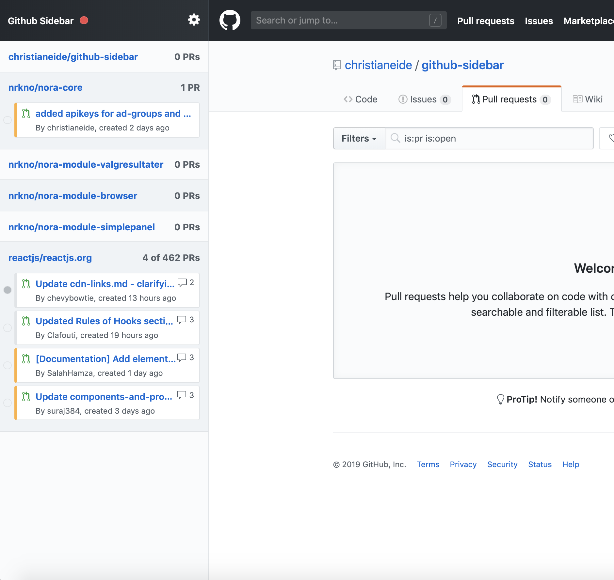
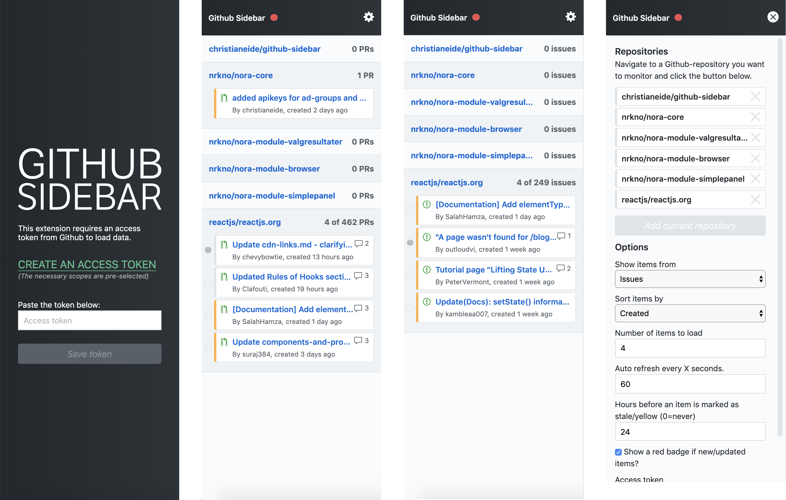

# GitHub Sidebar

Do you often navigate between several repositories on GitHub? This Chrome Extension lets you bookmark repositories in a sidebar injected only on GitHub pages. The sidebar will let you navigate faster and give you better control over your most used repositories. 

The extension can be installed through the [Chrome Web Store](https://chrome.google.com/webstore/detail/github-sidebar/lblnbldblpeiikndppnekobccdocccho)

**Features**

- Easy to bookmark and navigate repositories
- Overview over active Pull requests or Issues for your repos
- Periodically checks for new or updated items
- Optional to show badge in GitHub favicon if new items
- Loads fast, only 85kb
- Works across multiple tabs
- Color coding of items based on status (Approved, Closed or Stale)

## Screenshots

# Settings

### Repositories

Simply navigate to any Github repository you would like to add a shortcut to and press the button for *Add current repository*.

You can sort the order of repositories by simply drag&drop.

### Access Token

This extension requires an access token from Github to load data. Please [create an access token](https://github.com/settings/tokens/new?scopes=repo&description=Github%20sidebar%20browser%20extension)  to allow this extension to fetch necessary data from Github. The necessary scopes for the token is already selected if you follow the link above. All you need is to press "Generate Token", and copy/paste the token into the extension.

**Note:** The token is only saved to your browsers local *chrome.storage.local* and only used to communicate with Githubs API.

### Other settings
Should (hopefully) be pretty self explanatory

## Known limitations
The extension keeps a track of the status of the number of items you have loaded. Lets say you are displaying the four newest created pull requests. If the first pull request gets merged or closed, the plugin will then load in the previously fifth pull request. This item will now be marked as a new item in the list, even though you might have seen it before. By now this is a limitation of this extension, as it does not keep an extensive list over previously read or seen items.